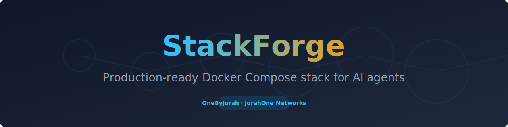
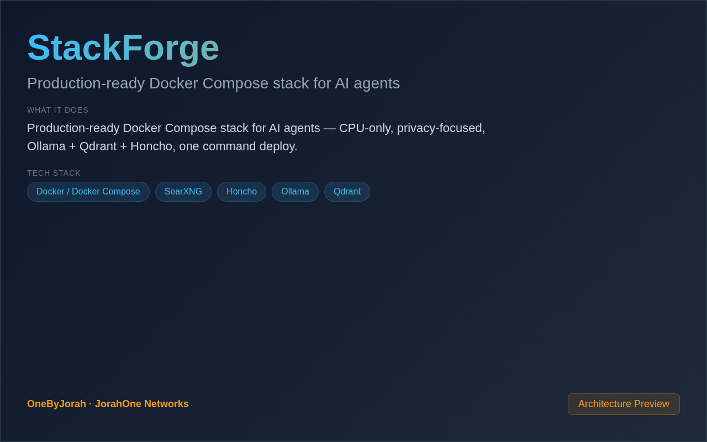

<div align="center">



# StackForge

Production-ready Docker Compose stack for AI agents


</div>

---

<p align="center">
  
</p>

<br>

---

## Features

- **One Command Deploy** — `docker compose up -d` and you're ready.
- **CPU-Only** — No GPU required, runs on any machine.
- **Privacy-Focused** — All data stays on your infrastructure.
- **Ollama LLMs** — Local language model hosting.
- **Qdrant Vector DB** — Vector storage for embeddings.
- **Honcho Memory** — Long-term agent memory.
- **SearXNG Search** — Private web search.
- **Production Ready** — Health checks, restarts, and monitoring.

## Quick Start

```bash
git clone https://github.com/OneByJorah/StackForge.git
cd StackForge

cp .env.example .env

# Deploy the stack
docker compose up -d
```

### Access Services

| Service | URL |
|---------|-----|
| Ollama | http://localhost:11434 |
| Qdrant | http://localhost:6333 |
| Honcho | http://localhost:4000 |
| SearXNG | http://localhost:8080 |

## Stack Components

| Component | Purpose |
|-----------|---------|
| **Ollama** | Local LLM hosting (Llama2, Mistral, etc.) |
| **Qdrant** | Vector database for embeddings |
| **Honcho** | Long-term agent memory |
| **SearXNG** | Privacy-respecting web search |
| **PostgreSQL** | Relational database |
| **Redis** | Caching and queues |

## Configuration

| Variable | Default | Description |
|----------|---------|-------------|
| `OLLAMA_MODELS` | `llama2,mistral` | Models to download |
| `QDRANT_PORT` | `6333` | Qdrant API port |
| `HONCHO_PORT` | `4000` | Honcho API port |
| `POSTGRES_DB` | `stackforge` | PostgreSQL database |
| `POSTGRES_USER` | `stackforge` | PostgreSQL user |
| `POSTGRES_PASSWORD` | *(generated)* | PostgreSQL password |

## Architecture

```
AI Agent ──API──▶ Services
    │
    ├──▶ Ollama (LLM)
    ├──▶ Qdrant (Vectors)
    ├──▶ Honcho (Memory)
    ├──▶ SearXNG (Search)
    ├──▶ PostgreSQL (Data)
    └──▶ Redis (Cache)
```

## Project Structure

```
StackForge/
├── docker-compose.yml     # Main compose file
├── .env.example           # Environment template
├── ollama/
│   └── Modelfile          # Custom model configs
├── qdrant/
│   └── config.yaml        # Qdrant configuration
├── scripts/
│   ├── setup.sh           # Initial setup
│   ├── health-check.sh    # Health monitoring
│   └── backup.sh          # Data backup
└── README.md
```

## Hardware Requirements

| Scale | CPU | RAM | Storage |
|-------|-----|-----|---------|
| **Basic** | 4 cores | 8GB | 50GB |
| **Standard** | 8 cores | 16GB | 100GB |
| **Performance** | 16 cores | 32GB | 200GB+ |

## Contributing

Contributions are welcome. Please see [CONTRIBUTING.md](CONTRIBUTING.md) for guidelines and [CODE_OF_CONDUCT.md](CODE_OF_CONDUCT.md) for community standards.

## Security

For security concerns, see [SECURITY.md](SECURITY.md). Please report vulnerabilities to **info@jorahone.com** — do not use public issues.

## License

MIT © Jhonattan L. Jimenez

---

## 🤝 Contributing

See [CONTRIBUTING.md](CONTRIBUTING.md). All contributions follow the [Code of Conduct](CODE_OF_CONDUCT.md).

## 🔒 Security

Found a vulnerability? Please follow our [Security Policy](SECURITY.md) and report privately to `security@jorahone.com`.

## 📄 License

[MIT License](LICENSE) © Jhonattan L. Jimenez (OneByJorah)

---

<p align="center">Built with 🌴 by <a href="https://github.com/OneByJorah">OneByJorah</a> · <a href="https://jorahone.com">jorahone.com</a></p>
