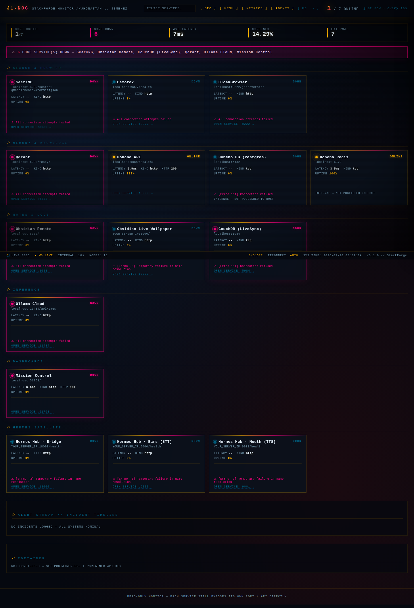
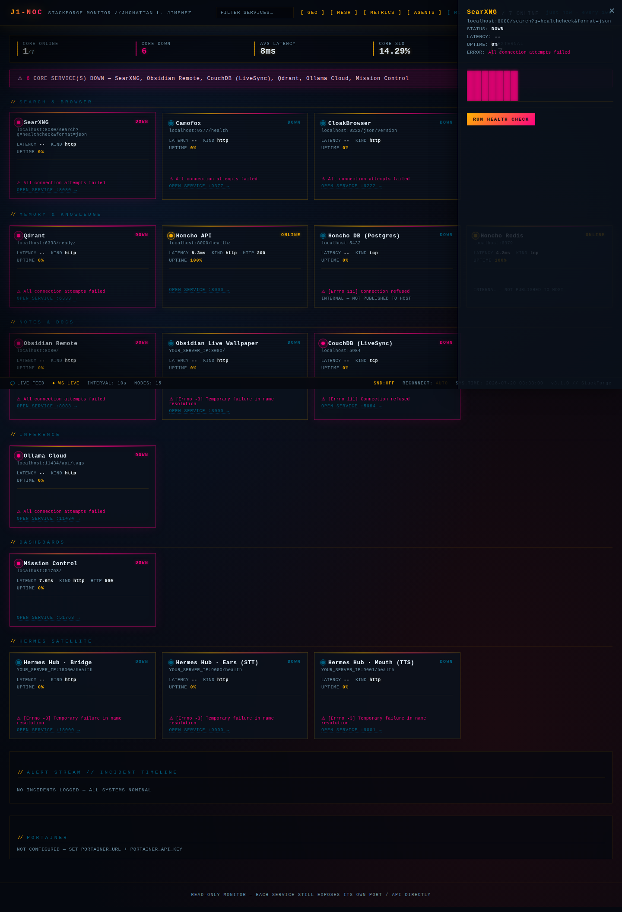
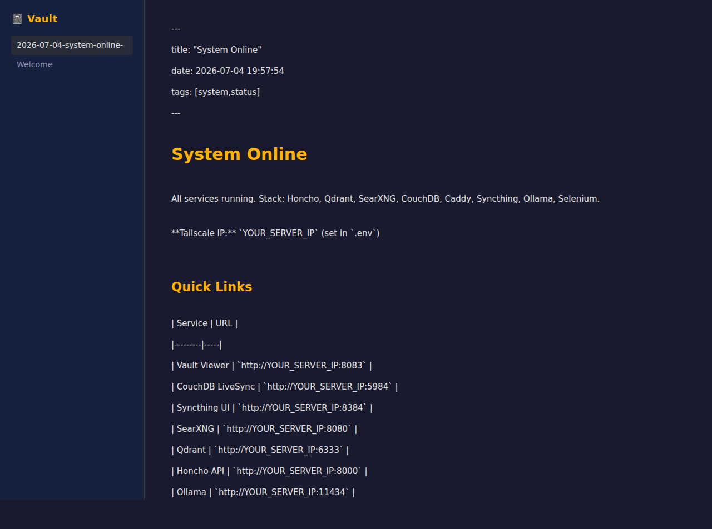

# 🔧 StackForge

### Production-ready Docker Compose stack for self-hosted AI-agent infrastructure — search, memory, vector store, notes, browser automation, and a live NOC dashboard.

One IP, one stack. CPU-first, privacy-focused, self-hosted. StackForge bundles the services a Hermes-style agent needs to run autonomously, wired together with health checks, network isolation, and an optional ops-grade monitoring dashboard.

[](LICENSE)
[](#-docker-recommended)
[](#-screenshots)



## ✨ Features

- **One-command deploy** — `docker-compose up -d` brings up the full stack.
- **Privacy-first search** — Self-hosted SearXNG metasearch, no third-party APIs.
- **Long-term memory** — Honcho API on PostgreSQL + pgvector + Redis.
- **Vector store** — Qdrant for RAG / semantic search.
- **Notes & sync** — CouchDB LiveSync backend, Obsidian web viewer, Syncthing P2P sync.
- **Browser automation** — Selenium standalone Chrome for agent web tasks.
- **Local LLM** — Ollama for offline inference (optional GPU).
- **Live monitoring** — J1-NOC dashboard: per-service health, latency scopes, incident stream.
- **Tailscale-native** — All services reachable via one IP; no public ports required.

## 🚀 Quick Start

### Docker (recommended)

```bash
git clone https://github.com/OneByJorah/StackForge.git
cd StackForge

# 1. Configure environment (placeholders only — never commit real secrets)
cp .env.example .env
#   set SERVER_IP, HONCHO_DB_PASSWORD, HONCHO_TOKEN, COUCHDB_* passwords

# 2. Bring up the stack
docker-compose up -d

# 3. Check health
docker-compose ps
```

> `docker-compose` v2 is required (the repo's `docker-compose.yml` validates
> with `docker-compose config`). NOC dashboard and the static site also build
> as standalone images (see [Architecture](#-architecture--how-it-works)).

### Manual / from source (NOC dashboard only)

The monitoring dashboard runs without Docker for local development:

```bash
cd noc-dashboard/backend
python3 -m venv .venv && . .venv/bin/activate
pip install -r requirements.txt
PORT=9500 python standalone.py
# open http://localhost:9500
```

The Obsidian web vault viewer is a static app — serve `obsidian/` over any
HTTP server that provides `/vault/index.json` and `/vault/<note>`.

## 📸 Screenshots

| View | What it shows |
|------|---------------|
|  | **J1-NOC monitor** — fleet status grid, service cards, live incident stream. |
|  | **Service detail drawer** — run a health check, view latency history per service. |
|  | **Obsidian web vault viewer** — markdown notes rendered from the synced vault. |

## 🏗️ Architecture / How It Works

```
┌────────────────────────────────────────────────────┐
│               TAILSCALE NETWORK (single IP)          │
└────────────────────────────────────────────────────┘
                         │
         ┌───────────────┼───────────────────────────┐
         ▼               ▼                           ▼
   SEARCH / BROWSER   MEMORY / KNOWLEDGE        NOTES / INFERENCE
   SearXNG  (8080)    Honcho + PG + Redis       CouchDB / Obsidian / Syncthing
   Selenium (4444)    Qdrant  (6333)            Ollama (11434)  NOC (9500)
```

- Two Docker networks: `stackdeploy-tailnet` (exposed) and `stackdeploy-backend`
  (`internal: true` for DB/cache — credentials never reach the host network).
- Each image's health check uses the tool it actually ships (`wget`, `bash
  /dev/tcp`, `python3 urllib`, `curl`) so `docker-compose ps` reports real status.
- **J1-NOC dashboard** polls every service over HTTP, renders status + latency
  history, and exposes `/api/status` (JSON) + a WebSocket live feed. It runs as
  `noc-dashboard/backend/standalone.py` and builds via `noc-dashboard/Dockerfile`.

## ⚙️ Configuration

All secrets live in `.env` (gitignored). Copy `.env.example` and fill placeholders.

| Variable | Purpose | Required |
|----------|---------|----------|
| `SERVER_IP` | Tailscale/local IP for service URLs | Yes |
| `HONCHO_DB_PASSWORD` | PostgreSQL password for Honcho | Yes |
| `HONCHO_TOKEN` | Honcho API auth token | Yes |
| `COUCHDB_ADMIN_USER` / `_PASSWORD` | CouchDB admin | Yes |
| `COUCHDB_SYNC_USER` / `_PASSWORD` | Obsidian LiveSync user | Yes |
| `OBSIDIAN_VAULT_PATH` | Host path for agent notes | Optional |

Honcho's optional LLM provider is configured via `.env.honcho` (see
`.env.honcho.example`). **No configuration is needed to run the stack itself.**

## 🧪 Testing

StackForge is infrastructure-as-code; there is no unit-test suite. Verification:

```bash
# 1. Compose is valid
docker-compose config

# 2. The monitoring dashboard serves a live status API
curl -s http://localhost:9500/api/status | head

# 3. Every service reports health to Docker
docker-compose ps
```

Legacy smoke script: `tests/smoke.sh`.

## 🤝 Contributing

Fork → branch → PR. Keep `.env` out of commits. Run `docker-compose config`
before opening a PR. See `CONTRIBUTING.md` and `CODE_OF_CONDUCT.md`.

## 📄 License

MIT — see [LICENSE](LICENSE).

## 👤 Author

Built by **Jhonattan L. Jimenez** ([@OneByJorah](https://github.com/OneByJorah))
under **JorahOne LLC**.

More projects: [github.com/OneByJorah](https://github.com/OneByJorah)
