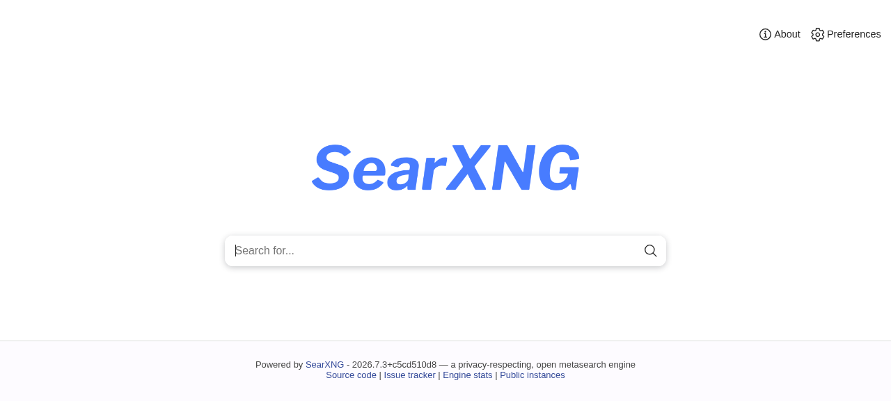

# StackDeploy

**Version:** v2.0  
**Status:** Production Ready  
**Repository:** https://github.com/OneByJorah/StackDeploy

---

## Table of Contents

- [Overview](#overview)
- [Architecture](#architecture)
- [Technology Stack](#technology-stack)
- [Services](#services)
- [Features](#features)
- [Getting Started](#getting-started)
- [Environment Variables](#environment-variables)
- [Service Management](#service-management)
- [Admin Panel](#admin-panel)
- [CI/CD & Deployment](#cicd--deployment)
- [Security](#security)
- [Project Structure](#project-structure)
- [Screenshots](#screenshots)
- [Hermes Integration](#hermes-integration)
- [License](#license)
- [Author](#author)

---

## Overview

StackDeploy is a **unified, production-ready Docker Compose deployment** that consolidates self-hosted web search, long-term memory, browser automation, vector storage, and Obsidian note-taking under a single IP with centralized management. Designed to run on consumer hardware with Tailscale networking, exposing everything through direct ports.

**Core philosophy:** One stack, one IP, one admin panel, zero secrets in git.

### Bundled Services

| Category | Services |
|----------|----------|
| **Search & Browser** | SearXNG (8080), Camofox (9377), CloakBrowser (9222) |
| **Memory & Knowledge** | Honcho Memory API (8081) + pgvector/Redis, Qdrant (6333) |
| **Notes & Docs** | Obsidian Remote (8083) |
| **Admin & Ops** | **Portainer (9000/9443)** - Full container management |

---

## Architecture

```
┌─────────────────────────────────────────────────────────────────┐
│                    TAILSCALE NETWORK                            │
│  <ollama-tailscale-ip> (ollama host)                                    │
└─────────────────────────────────────────────────────────────────┘
                              │
                              ▼
┌─────────────────────────────────────────────────────────────────┐
│                    STACKDEPLOY                                  │
│  ┌───────────────────────────────────────────────────────────┐  │
│  │  SEARCH & BROWSER              MEMORY & KNOWLEDGE          │  │
│  │  SearXNG (8080)                Honcho API (8081)           │  │
│  │  Camofox (9377)                Qdrant (6333)               │  │
│  │  CloakBrowser (9222)           PostgreSQL + Redis          │  │
│  └───────────────────────────────────────────────────────────┘  │
│                              │                                   │
│        ┌─────────────────────┼─────────────────────┐             │
│        ▼                     ▼                     ▼             │
│  ┌───────────┐         ┌───────────┐         ┌───────────┐     │
│  │  NOTES    │         │  ADMIN    │         │  OPTIONAL │     │
│  │ Obsidian  │         │ Portainer │         │ Ollama    │     │
│  │ (8083)    │         │ (9000)    │         │ (11434)   │     │
│  └───────────┘         └───────────┘         └───────────┘     │
└─────────────────────────────────────────────────────────────────┘
```

**Data Flow:**
- Hermes Agent → Local services (search, memory, browser) → Optional upstream LLM via Hermes config
- All services communicate over Docker internal network
- Single Tailscale IP exposes everything via direct ports

---

## Technology Stack

| Layer | Stack |
|-------|-------|
| Runtime | Linux (Ubuntu 22.04+), Docker Compose |
| Orchestration | Docker Compose v2, Bash bootstrap scripts |
| VCS | Git + GitHub (`github.com/OneByJorah/StackDeploy`) |
| Memory/Context | Honcho (pgvector + Redis), Qdrant |
| Search | SearXNG + Camofox (stealth browser) |
| Notes | Obsidian Remote (web UI) |
| Admin | **Portainer CE** (full container lifecycle, RBAC, backups) |
| Notifications | Telegram (J1-bot) |
| CI/CD | GitHub Actions (build, test, deploy) |

---

## Services

| Service | Port | Health Endpoint | Purpose |
|---------|------|-----------------|---------|
| **SearXNG** | 8080 | `/search?q=healthcheck&format=json` | Privacy-respecting metasearch |
| **Camofox** | 9377 | `/health` | Stealth browser automation API |
| **CloakBrowser** | 9222 | `/json/version` | Stealth browser for protected sites |
| **Obsidian** | 8083 | `/` | Remote vault web UI |
| **Qdrant** | 6333 | `/readyz` | Vector database |
| **Honcho API** | 8081 | `/healthz` | Long-term memory for agents |
| **Honcho DB** | 5432 | `pg_isready` | PostgreSQL + pgvector |
| **Honcho Redis** | 6379 | `redis-cli ping` | Cache layer |
| **Portainer** | 9000/9443 | `/` | **Admin panel - full container mgmt** |

---

## Features

- ✅ **Single-command bootstrap** - `./scripts/bootstrap.sh` clones, configures, starts, validates
- ✅ **Zero-secrets in git** - `.env.example` documents all vars; `.env` is gitignored
- ✅ **Health checks on every service** - Docker healthchecks + `./scripts/healthcheck.sh`
- ✅ **Portainer admin panel** - Visual container management, logs, stats, backups, RBAC
- ✅ **CPU-first with GPU option** - Runs on CPU; Ollama on Tailscale host for GPU inference
- ✅ **Extensible Compose blocks** - Add services by dropping in compose fragments
- ✅ **CI/CD pipeline** - GitHub Actions: lint, build, test, deploy on push
- ✅ **Hermes Agent integration** - Skills for search, memory, browser, notes

---

## Getting Started

### Prerequisites
- Docker 24+ & Docker Compose v2
- Tailscale (for multi-host Ollama access)
- 8GB+ RAM, 50GB+ disk

### Quick Start

```bash
# 1. Clone
git clone https://github.com/OneByJorah/StackDeploy.git
cd StackDeploy

# 2. Configure environment
cp .env.example .env
# Edit .env: set HONCHO_DB_PASSWORD, NEO4J_AUTH, CAMOFOX_API_KEY, etc.

# 3. One-command deploy
./scripts/bootstrap.sh

# 4. Verify
./scripts/healthcheck.sh localhost
```

### Manual Start

```bash
docker compose up -d
./scripts/healthcheck.sh localhost
```

### Access Points

| Interface | URL |
|-----------|-----|
| **Portainer (Admin)** | http://localhost:9000 (HTTPS: 9443) |
| **SearXNG** | http://localhost:8080 |
| **Camofox** | http://localhost:9377 |
| **CloakBrowser** | http://localhost:9222 |
| **Obsidian** | http://localhost:8083 |
| **Honcho API** | http://localhost:8081 |
| **Qdrant** | http://localhost:6333 |

---

## Environment Variables

All secrets in `.env` (never committed). See `.env.example` for full list.

| Variable | Purpose | Required |
|----------|---------|----------|
| `HONCHO_DB_PASSWORD` | PostgreSQL password for Honcho | Yes |
| `CAMOFOX_API_KEY` | Camofox auth key | Optional |
| `CAMOFOX_ADMIN_KEY` | Camofox admin key | Optional |
| `OBSIDIAN_VAULT_PATH` | Host path for Obsidian vault | Optional |
| `SERVER_IP` | Tailscale/local IP for docs | Optional |
| `NEO4J_AUTH` | Neo4j auth (if enabled) | Optional |

---

## Service Management

```bash
# Start all
docker compose up -d

# Stop all
docker compose down

# View logs (all or specific)
docker compose logs -f
docker compose logs -f honcho

# Restart single service
docker compose restart honcho

# Health check
./scripts/healthcheck.sh localhost

# Full status
docker compose ps
```

### Portainer Admin Panel

**The primary management interface.** After first start:
1. Open http://localhost:9000
2. Create admin user
3. Select "Docker" environment (local)
4. Manage all containers: start/stop, logs, stats, console, volumes, networks

Features used:
- **Container lifecycle** - restart, update images, recreate
- **Logs & console** - debug without SSH
- **Resource stats** - CPU, memory, network per container
- **Volumes & networks** - inspect, backup, prune
- **RBAC** - team access control
- **Backup/Restore** - Portainer settings + stack configs

---

## Admin Panel

**Portainer** is the single admin interface for the entire stack. No custom admin panel code needed - Portainer provides:

- ✅ Container management (start/stop/restart/recreate)
- ✅ Real-time logs & console access
- ✅ Resource monitoring (CPU, RAM, network, disk)
- ✅ Volume & network management
- ✅ Image management (pull, prune, tag)
- ✅ Stack deployment from git
- ✅ RBAC for team access
- ✅ Backup/restore of Portainer config

---

## CI/CD & Deployment

**GitHub Actions** (`.github/workflows/ci-cd.yml`):

```yaml
# Triggers: push to main, PR to main
# Jobs:
#   1. lint       - hadolint, shellcheck, yamllint
#   2. build      - docker compose build (all services)
#   3. test       - spin up stack, run healthcheck.sh
#   4. deploy     - SSH to server, pull, restart (on main)
```

**Branch model:** `main` = stable; feature branches for WIP.

**Deploy:** `git push origin main` → auto-deploys to configured host via SSH.

---

## Security

- **No secrets in git** - `.env` in `.gitignore`; `.env.example` has placeholders
- **Portainer auth** - Admin user required on first access; RBAC for teams
- **Network isolation** - Services on internal Docker network; only explicitly mapped ports exposed
- **Tailscale** - All inter-host traffic encrypted; no public ports needed
- **Read-only mounts** - Config files mounted `:ro` where possible
- **Non-root containers** - Most services run as unprivileged users

---

## Project Structure

```
StackDeploy/
├── docker-compose.yml          # 9 services, validated
├── .env.example                # Documented placeholders
├── .env                        # Local secrets (gitignored)
├── .gitignore
├── browser-search/             # Camofox + CloakBrowser helpers
│   ├── SKILL.md
│   ├── scripts/
│   └── docker/
├── obsidian-skills/            # Agent skills for Obsidian
│   └── skills/
│       ├── defuddle/
│       ├── json-canvas/
│       ├── obsidian-bases/
│       ├── obsidian-cli/
│       └── obsidian-markdown/
├── scripts/
│   ├── bootstrap.sh            # One-command deploy
│   ├── healthcheck.sh          # Validates all 9 services
│   ├── init-honcho.sh          # Honcho alembic migrations
│   └── init-obsidian.sh        # Vault initialization
├── .github/
│   └── workflows/
│       └── ci-cd.yml           # Full CI/CD pipeline
├── docs/
│   ├── SERVER_SETUP.md
│   └── HERMES_SETUP.md
└── README.md
```

---

## Screenshots

All screenshots are live captures from the local dev instance (<ollama-tailscale-ip>).

### Portainer Admin Panel (Port 9000)

*Full container lifecycle management*

### SearXNG Search (Port 8080)

*Privacy-respecting metasearch*

### Camofox Browser (Port 9377)

*Stealth browser automation*

### Obsidian Remote (Port 8083)

*Web-based vault access*

### Honcho Memory API (Port 8081)

*Long-term memory for agents*

---

## Hermes Integration

StackDeploy ships first-class Hermes Agent skills.

### Local Install Path

```bash
~/.hermes/skills/devops/stackdeploy/SKILL.md
```

### Inline Commands

```bash
# Health check
cd /home/j1admin/StackDeploy && bash scripts/healthcheck.sh localhost

# JSON search via SearXNG
curl -s 'http://localhost:8080/search?format=json&q=<query>&language=en'

# Browser automation via Camofox
curl -X POST http://localhost:9377/api/v1/browse \
  -H "Content-Type: application/json" \
  -d '{"url": "https://example.com", "action": "screenshot"}'

# CloakBrowser for protected sites
cd /home/j1admin/StackDeploy/browser-search && node scripts/cloak/cloak-fetch.mjs "https://example.com"

# Honcho memory operations
curl -X POST http://localhost:8081/api/v1/memory \
  -H "Authorization: Bearer $HONCHO_TOKEN" \
  -d '{"text": "Remember this..."}'
```

### Skill Files

| Script | Purpose |
|--------|---------|
| `scripts/healthcheck.sh` | Full stack validation |
| `scripts/bootstrap.sh` | One-command deploy |
| `scripts/init-honcho.sh` | Run alembic migrations |

---

## License

MIT

---

## Author

Built by **Jhonattan L. Jimenez** (J1admin).

- GitHub: [@OneByJorah](https://github.com/OneByJorah)
- Tailscale: `ollama` (<ollama-tailscale-ip>)
- Primary GPU: RTX 3060 12GB