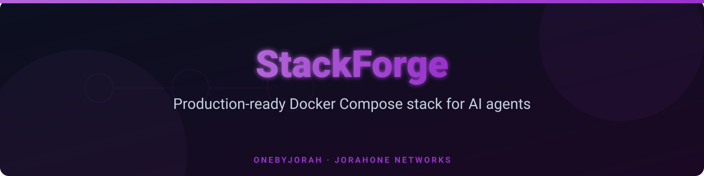
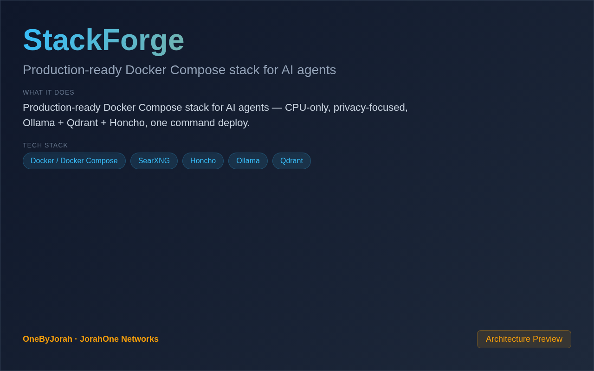

<div align="center">



# StackForge

**CPU-only, privacy-focused Docker Compose stack for AI agents — local LLM, vector search, long-term memory, and synced notes, all self-hosted**

[](https://github.com/OneByJorah/StackForge/releases)
[](https://www.docker.com/)
[](https://docs.docker.com/compose/)
[](https://ollama.com/)
[](https://www.trychroma.com/)
[](https://www.cpu-only.ai/)
[](https://opensource.org/licenses/MIT)

</div>



## What This Is

StackForge bundles the pieces an AI agent needs to run privately on your own hardware: a local LLM, a vector database, persistent memory, private search, a synced notes vault, and browser automation. It targets CPU-only boxes — a VPS, homelab server, or bare-metal machine — and keeps all agent context on infrastructure you control instead of a vendor's.

Built for privacy-conscious developers, homelab operators, and anyone who wants a complete AI agent stack without sending data to the cloud.

## Quick Start

### Docker Compose (recommended)

```bash
git clone https://github.com/OneByJorah/StackForge.git
cd StackForge
cp .env.example .env
docker compose up -d
```

Open **http://localhost:8083** for the vault viewer.

For an interactive first-run wizard that generates secrets and sets your IP, run `bash bootstrap.sh` instead.

### pip

```bash
pip install stackforge
```

### From Source

```bash
git clone https://github.com/OneByJorah/StackForge.git
cd StackForge
pip install -r requirements.txt
python3 -m stackforge
```

## Install

### Docker Compose

```bash
git clone https://github.com/OneByJorah/StackForge.git
cd StackForge
cp .env.example .env
docker compose up -d
```

### pip

```bash
pip install stackforge
```

### From Source

```bash
git clone https://github.com/OneByJorah/StackForge.git
cd StackForge
pip install -r requirements.txt
python3 -m stackforge
```

## Features

- **One-command deploy** — `docker compose up -d` (or `bootstrap.sh` for guided setup)
- **Interactive first run** — `bootstrap.sh` prompts for secrets, generates random passwords, seeds the vault
- **Local LLM** — Ollama-based, CPU-only inference, no GPU required
- **Vector database** — ChromaDB for long-term memory and semantic search
- **Persistent memory** — Honcho-backed long-term memory store
- **Private search** — Self-hosted SearXNG for private web search
- **Synced notes vault** — Obsidian-compatible notes synchronized across agents
- **Browser automation** — Playwright-powered browser for web automation
- **CPU-only** — No GPU required, runs on any VPS or homelab server
- **Privacy-first** — All agent context stays on your hardware

## Tech Stack

- **Orchestration** — Docker Compose (14 services)
- **LLM** — Ollama (CPU inference)
- **Vector DB** — ChromaDB
- **Memory** — Honcho
- **Search** — SearXNG
- **Notes** — Obsidian vault
- **Browser** — Playwright
- **Python** — 3.11+, pydantic, pyyaml, requests, chromadb, numpy

## Package Badges

[](https://github.com/OneByJorah/StackForge/releases)
[](https://www.docker.com/)
[](https://docs.docker.com/compose/)
[](https://opensource.org/licenses/MIT)

## Architecture

```
┌─────────────────────────────────────────────────────────┐
│                   StackForge Stack                       │
│  (14 services, CPU-only, Docker Compose)                │
│                                                         │
│  ┌──────────┐  ┌──────────┐  ┌──────────┐  ┌────────┐ │
│  │  Ollama  │  │ ChromaDB │  │ Honcho   │  │SearXNG │ │
│  │  (LLM)   │  │(Vector)  │  │ (Memory) │  │(Search)│ │
│  └──────────┘  └──────────┘  └──────────┘  └────────┘ │
│  ┌──────────┐  ┌──────────┐  ┌──────────┐  ┌────────┐ │
│  │  Vault   │  │  Nginx   │  │ Playwright│  │ Redis  │ │
│  │(Notes)   │  │(Proxy)   │  │ (Browser) │  │(Cache) │ │
│  └──────────┘  └──────────┘  └──────────┘  └────────┘ │
└─────────────────────────────────────────────────────────┘
```

## Configuration

Copy `.env.example` to `.env` and configure:

| Variable | Description |
|----------|-------------|
| `OLLAMA_MODEL` | Default Ollama model (default: `llama3.2`) |
| `VAULT_PORT` | Vault viewer port (default: 8083) |
| `SEARXNG_URL` | SearXNG instance URL |
| `REDIS_URL` | Redis connection URL |

For interactive setup: run `bash bootstrap.sh` — generates secrets, sets IP, seeds vault.

## Services

| Service | Purpose |
|---------|---------|
| `ollama` | Local LLM inference (CPU) |
| `chromadb` | Vector database for memory |
| `honcho` | Long-term memory store |
| `searxng` | Private web search |
| `vault` | Obsidian notes viewer (port 8083) |
| `nginx` | Reverse proxy / gateway |
| `playwright` | Browser automation |
| `redis` | Cache and session store |
| `+` 6 more supporting services | |

## Contributing

Contributions are welcome. [Open an issue](https://github.com/OneByJorah/StackForge/issues) to report a bug or request a feature.

## License

MIT — see [LICENSE](LICENSE).
