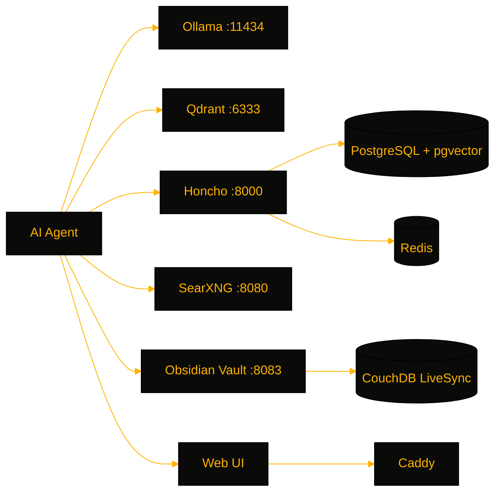

# StackForge

> CPU-only, privacy-focused Docker Compose stack that gives AI agents local LLMs, vector search, long-term memory, private search, and a synced notes vault on hardware you control.

[](https://github.com/OneByJorah/StackForge)
[](https://github.com/OneByJorah/StackForge)
[](https://github.com/OneByJorah/StackForge/stargazers)
[](https://github.com/OneByJorah/StackForge/commits)


## What This Is

StackForge bundles the pieces an AI agent needs to run privately on your own hardware — a local LLM, a vector database, persistent memory, private web search, a synced Obsidian vault, and browser automation — into one compose file. It targets CPU-only boxes: a VPS, homelab server, or bare-metal machine. Built for people who want agent infrastructure without renting a vendor's cloud.

## Quick Start

```bash
git clone https://github.com/OneByJorah/StackForge.git
cd StackForge
cp .env.example .env
docker compose up -d
```

For a guided first run that generates secrets and sets your IP, use `bash bootstrap.sh`. Open `http://localhost:8083` for the vault viewer.

## Features

- One-command deploy of ten services via Docker Compose, with an interactive `bootstrap.sh` wizard
- Ollama serving local LLMs (Llama, Mistral, Phi, and more) on CPU; GPU off-load is a one-line change
- Honcho long-term agent memory backed by PostgreSQL + pgvector and Redis
- SearXNG metasearch for private, tracking-free web queries
- Obsidian vault sync via CouchDB LiveSync plus Syncthing for laptop-to-server replication
- Standalone Selenium Chrome container for browser automation tasks
- Optional overlays for Headroom monitoring and Portainer container management

## Architecture

Two Docker networks isolate traffic: a `tailnet` bridge for exposed services and an internal `backend` network for the database and cache.


```mermaid
%%{init: {'theme':'base','themeVariables':{'primaryColor':'#0a0a09','primaryTextColor':'#FFB300','lineColor':'#FFB300'}}}%%
graph LR
    A[AI Agent] --> B[Ollama :11434]
    A --> C[Qdrant :6333]
    A --> D[Honcho :8000]
    D --> E[(PostgreSQL + pgvector)]
    D --> F[(Redis)]
    A --> G[SearXNG :8080]
    A --> H[Obsidian Vault :8083]
    A --> I[Selenium Chrome :4444]
    H --> J[(CouchDB LiveSync)]
    I[Web UI] --> K[Caddy]
```

## Stack

Docker Compose, Ollama, Qdrant, Honcho, SearXNG, PostgreSQL + pgvector, Redis, CouchDB, Caddy, Syncthing, Selenium, Jinja2 config templates

## Contributing

Contributions are welcome — read [CONTRIBUTING.md](CONTRIBUTING.md) and [open an issue](https://github.com/OneByJorah/StackForge/issues) to report a bug or request a feature.

## License

MIT — see [LICENSE](LICENSE).
