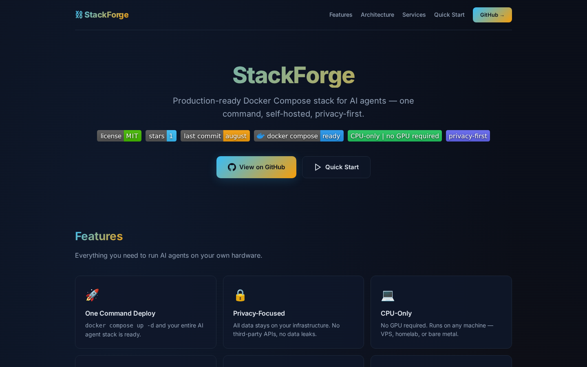
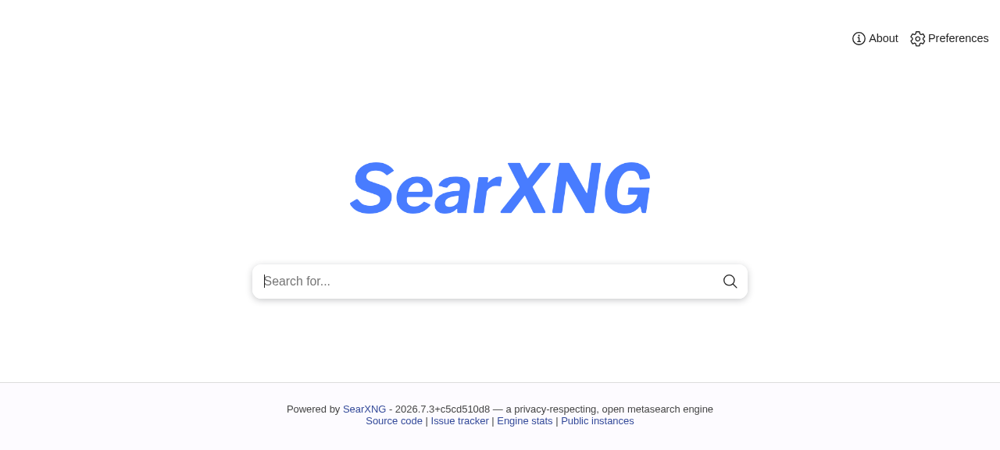
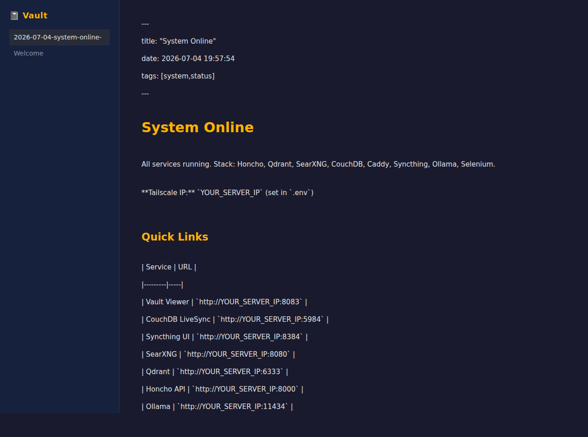

<div align="center">


# StackForge

**CPU-only, privacy-focused Docker Compose stack for AI agents** — local LLM, vector search, long-term memory, and synced notes, all self-hosted.

<a href="https://github.com/OneByJorah/StackForge/stargazers"></a>
<a href="https://github.com/OneByJorah/StackForge/commits"></a>


</div>

## Quick Start

```bash
git clone https://github.com/OneByJorah/StackForge.git
cd StackForge
cp .env.example .env
docker compose up -d
```

For an interactive first-run wizard that generates secrets and sets your IP, run `bash bootstrap.sh` instead. Open **http://localhost:8083** for the vault viewer.

## What This Is

StackForge bundles the pieces an AI agent needs to run privately on your own hardware: a local LLM, a vector database, persistent memory, private search, a synced notes vault, and browser automation. It targets CPU-only boxes — a VPS, homelab server, or bare-metal machine — and keeps all agent context on infrastructure you control instead of a vendor's.

## Features

- **One-command deploy** — `docker compose up -d` (or `bootstrap.sh` for a guided setup) brings the stack online.
- **Interactive first run** — `bootstrap.sh` prompts for secrets, generates random passwords, and seeds the vault.
- **CPU-only** — no GPU required; GPU acceleration can be enabled by uncommenting the Ollama deploy block.
- **Local LLMs** — Ollama serves Llama 3, Mistral, Phi, and more, with Honcho embeddings via `nomic-embed-text`.
- **Agent memory** — Honcho (pgvector Postgres + Redis) provides long-term agent memory.
- **Private search** — SearXNG aggregates web search without tracking.
- **Obsidian sync** — CouchDB LiveSync plus Syncthing for laptop ↔ server vault sync.
- **Web automation** — Selenium standalone Chrome for browser tasks.

## Services

| Service | Port | Purpose | Image |
|---------|------|---------|-------|
| **Ollama** | `11434` | Local LLM hosting | `ollama/ollama` |
| **Qdrant** | `6333` | Vector database for embeddings | `qdrant/qdrant` |
| **Honcho API** | `8000` | Long-term agent memory | `ghcr.io/plastic-labs/honcho` |
| **SearXNG** | `8080` | Privacy-respecting metasearch | `searxng/searxng` |
| **PostgreSQL** | `5432` | Honcho backend (pgvector) | `pgvector/pgvector:pg15` |
| **Redis** | `6379` | Cache / queues | `redis:8.2` |
| **CouchDB** | `5984` | Obsidian LiveSync document store | `couchdb:3.4` |
| **Obsidian** | `8083` | Web vault viewer (Caddy) | `caddy:2-alpine` |
| **Syncthing** | `8384` | P2P file sync (laptop ↔ server) | `syncthing/syncthing` |
| **Selenium** | `4444` | Browser automation (Chrome) | `selenium/standalone-chrome` |

## Architecture

```
                   ┌─────────────┐
                   │  AI Agent   │
                   └──────┬──────┘
                          │
          ┌───────────────┼───────────────┐
          │               │               │
    ┌─────┴─────┐   ┌────┴────┐   ┌──────┴──────┐
    │  Ollama   │   │ Qdrant  │   │   Honcho    │
    │  :11434   │   │ :6333   │   │   :8000     │
    │ LLM Host  │   │ Vector  │   │   Memory    │
    └───────────┘   │   DB    │   └──────┬──────┘
                    └─────────┘          │
                                  ┌──────┴──────┐
                                  │  PostgreSQL │ Redis
                                  │  :5432      │ :6379
                                  └─────────────┘

    ┌──────────┐   ┌──────────┐   ┌─────────────┐
    │ SearXNG  │   │ Obsidian │   │  Selenium   │
    │ :8080    │   │ :8083    │   │  :4444      │
    │ Search   │   │ Vault    │   │  Automation │
    └──────────┘   └──────────┘   └─────────────┘
```

Two Docker networks are used: a `tailnet` bridge for exposed services and an internal `backend` network for the database and cache. Optional `docker-compose.headroom.yml` and `docker-compose.portainer.yml` overlays add monitoring and container management.

## Configuration

Copy `.env.example` to `.env` and set real values. Key variables:

| Variable | Default | Description |
|----------|---------|-------------|
| `SERVER_IP` | *(required)* | Host IP used in service URLs (Tailscale IP recommended) |
| `HONCHO_DB_PASSWORD` | `changeme` | PostgreSQL password (Honcho backend) — **change it** |
| `HONCHO_TOKEN` | *(required)* | Honcho API auth token |
| `SVC_HONCHO_PORT` | `8000` | Honcho API port |
| `SVC_SEARXNG_PORT` | `8080` | SearXNG port |
| `SVC_QDRANT_PORT` | `6333` | Qdrant API port |
| `SVC_COUCHDB_PORT` | `5984` | CouchDB / LiveSync port |
| `SVC_SYNCTHING_UI_PORT` | `8384` | Syncthing web UI port |
| `COUCHDB_ADMIN_USER` | `admin` | CouchDB admin username |
| `COUCHDB_ADMIN_PASSWORD` | `changeme` | CouchDB admin password — **change it** |
| `OBSIDIAN_VAULT_PATH` | `/path/to/your/obsidian/vault` | Host path for the vault |
| `OLLAMA_HOST` | `http://ollama:11434` | Ollama endpoint used by Honcho |

Honcho's LLM provider is configured separately in `.env.honcho.example` (OpenRouter/OpenAI-compatible). Headroom settings live in `.env.headroom.example`.

> [!WARNING]
> `bootstrap.sh` writes generated credentials to `obsidian/vault/credentials.md`. Delete that file after recording them, or keep the deployment behind Tailscale only.

## Use Cases

1. **Homelabbers** — run a private AI brain on a CPU-only server.
2. **AI developers** — build and test agents against local inference and memory.
3. **Privacy-conscious teams** — keep search, notes, and memory off third-party clouds.
4. **Field / edge deployments** — sync a vault from a laptop to a server with Syncthing.

## Tech Stack

Docker Compose, Ollama, Qdrant, Honcho, SearXNG, PostgreSQL + pgvector, Redis, CouchDB, Caddy, Syncthing, Selenium, Jinja2-based config templates.

## Screenshots

| View | Preview |
|------|---------|
| Landing hero |  |
| Full landing |  |
| Main viewport |  |
| SearXNG |  |
| Vault viewer |  |

## Project Structure

```
StackForge/
├── docker-compose.yml            # Main compose file (all services)
├── docker-compose.headroom.yml   # Headroom monitoring add-on
├── docker-compose.portainer.yml  # Portainer container management
├── .env.example                  # Environment variable template
├── bootstrap.sh                  # Interactive first-run setup wizard
├── index.html                    # Landing page
├── docs/                         # Setup guides + assets
├── scripts/                      # healthcheck, init, install helpers
├── searxng/                      # SearXNG configuration
├── honcho/                       # Honcho config
├── headroom/                     # Headroom config
├── obsidian/                     # Vault + Caddyfile
├── obsidian-skills/              # Obsidian plugin skills
├── noc-dashboard/                # NOC monitoring dashboard
├── browser-search/               # Browser search utilities
├── vendor/                       # Submodules (honcho, headroom)
└── tests/                        # Integration tests
```

## Contributing

Contributions are welcome. Please read [CONTRIBUTING.md](CONTRIBUTING.md) and [CODE_OF_CONDUCT.md](CODE_OF_CONDUCT.md), then [open an issue](https://github.com/OneByJorah/StackForge/issues) or a pull request.

## License

MIT — see [LICENSE](LICENSE).

## Connect

- [jorahone.com](https://jorahone.com)
- [GitHub Org](https://github.com/OneByJorah)
- [info@jorahone.com](mailto:info@jorahone.com)
